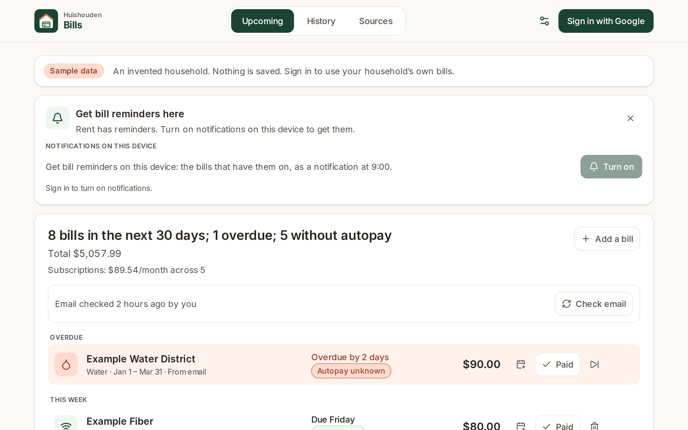
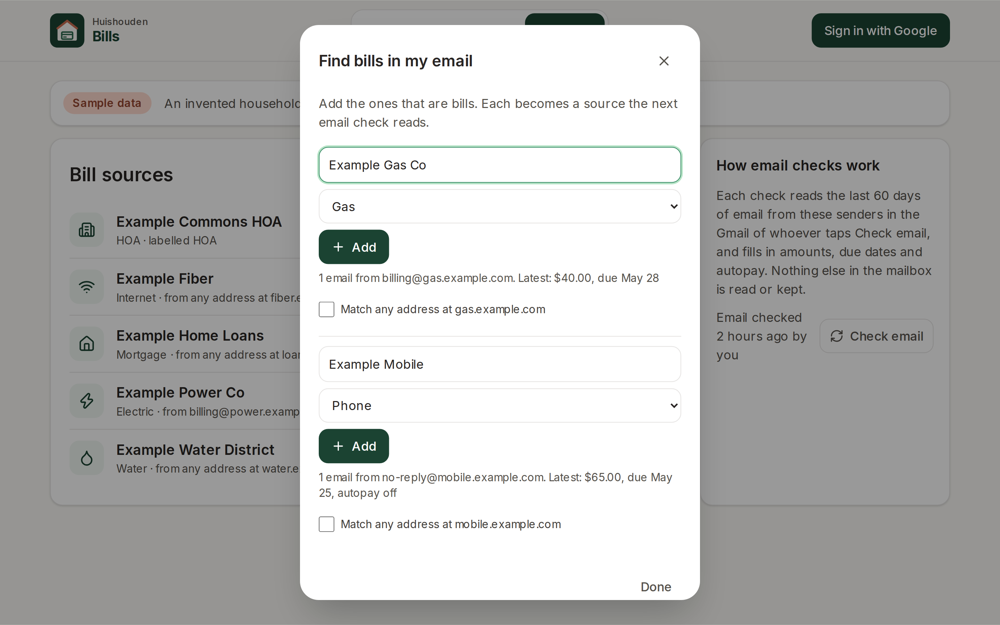
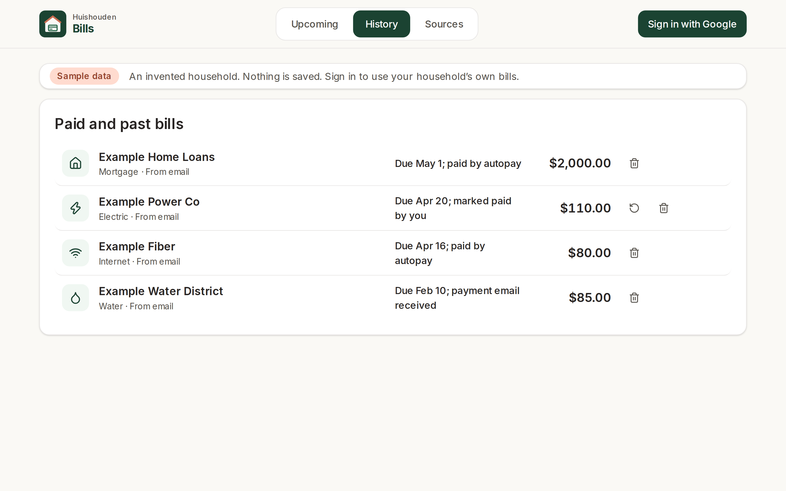
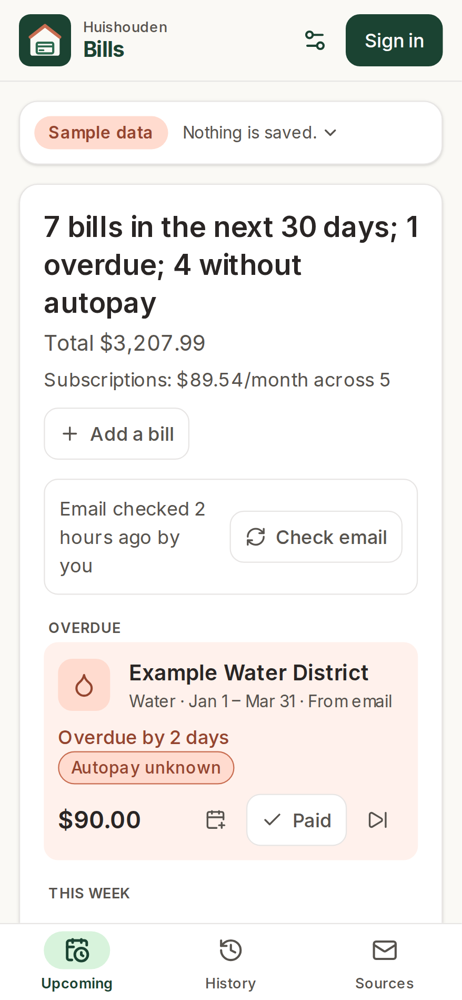

# Huishouden Bills

What's due, and when: the household's bills for the next 30 days, with the ones that need a hand
called out.

Live at https://huishouden-bills.web.app. It is also linked from the [Huishouden portal](https://huishouden-piekstra.web.app).

## Screenshots

| Upcoming | Find bills in my email |
|---|---|
|  |  |

| History | Phone |
|---|---|
|  |  |

_These are screenshots of the live site while signed out. Signed out, it shows an invented household dated in 2031. CI refreshes them after each deploy._

## How email checks work

1. A member taps **Find bills in my email**. Bills searches the last 60 days of their Gmail for
   statement wording ("statement is ready", "amount due", "payment due", "autopay", and similar).
   It groups the results by sender. The member names each sender that is a bill, sets its kind and
   adds it as a **bill source**. A source can also be added by hand, by sender address or domain,
   subject words, or Gmail label.
2. **Check email** runs one Gmail search per source (`from:(…) subject:(…) label:… newer_than:60d`)
   and reads up to 8 matching messages per source. Each message is parsed in the browser for:
   - the amount due
   - the due date
   - autopay wording, such as "will be automatically drafted on…", "You are enrolled in AutoPay"
     or "not enrolled"
   - the statement period
3. Each statement becomes one bill at `bills/{sourceId}_{dueDate}`, so reading it again rewrites
   the same document. Only bills whose content changed are written. A payment-confirmation email
   that arrives after a statement marks that statement paid.
4. A member's **Paid** and **Remove** are kept through later checks.
5. Google asks for Gmail access once, in a popup opened by a tap. Google shows an "unverified app"
   warning because the read-only Gmail scope is restricted. The access token lasts an hour. While
   it is valid, opening the app checks again on its own. After that, a check waits for a tap.
   Nothing opens a popup by itself.

The parser knows wording, not providers: no provider names or sender addresses are in the code.
Which senders are bills is household data in Firestore.

### Parser limits

- It reads dollar amounts (`$`) only.
- A due date is taken from the text next to a due-date label, or from the autopay draft date when
  there is no label. Bills that state only "due in 21 days" get no date.
- An email that offers autopay ("Sign up for AutoPay") does not count as enrolled. When the
  emails never say, the source's own autopay setting decides. Otherwise autopay shows as unknown,
  which counts as not covered.
- Statements that exist only as a PDF attachment, or behind a "view your bill" link with no figures
  in the email, give the source's name and date but no amount. Add the amount by hand, or let the
  bill show "—".
- It reads the latest 8 messages per source within 60 days.

## Data

Signed-in members of a Huishouden household read and write these documents under
`households/{householdId}`:

- `billSources/{id}`: name, kind, `from`/`subject`/`label` match, pay link, autopay when the emails
  are silent.
- `bills/{id}` (`bill/v1`): kind, label, due, `amountDue` `{amount, currency}`, `status`
  (`due`/`paid`/`credit`/`unknown`), `autopay` `{enrolled, nextDraft?}`, statement period, how it
  was paid, and `dismissed`.
- `billSync/{memberEmail}`: when that member last checked, with counts and per-source errors.
- `agenda/{id}` (app `bills`): each unpaid bill with a due date, as an all-day `bill` item on that
  date for the household agenda the portal shows. Title is the bill's name; detail is the amount and
  autopay state ("$84.20, autopay off"); status is `overdue` or `upcoming`, and absent for bills on
  autopay. Written when a bill is saved, paid, removed or read from email, and reconciled each time
  the app opens. Paid, credited, autopaid and replaced bills leave it.

The project's Firestore rules live in `huishouden/rules`.
Nothing from a mailbox is stored except these parsed fields and the Gmail message id. The message
id lets the member who checked open the email.

## Develop

```sh
bun install          # also enables the pre-commit leak scan
bun run env:pull     # writes .env.local from the repo's VITE_* variables
bun run dev          # http://localhost:3004
bun run lint && bun run test && bunx pwa-design-check && bun run build
bun run e2e          # smoke, sample-data flows and stubbed-Gmail tests against the live site (BASE_URL to override)
bun run screenshots  # README screenshots (SCREENSHOT_DIR to override)
```

The parser's sample emails are invented: they use example.com and dates in 2031. They are in
`src/lib/__fixtures__/emails/`, and adding a case means adding a file there. Browser tests stand in
for Gmail by setting `window.__gmailTestToken` and answering `gmail.googleapis.com` with
`page.route`.

Bills is built on [huishouden-pwa-kit](https://github.com/huishouden/pwa-kit) and follows its
[design language](https://github.com/huishouden/pwa-kit/blob/main/DESIGN.md) and
[standard](https://github.com/huishouden/pwa-kit/blob/main/STANDARD.md). Pushes to `main` deploy to
Firebase Hosting (site `huishouden-bills`), then run the smoke tests and refresh the screenshots.
